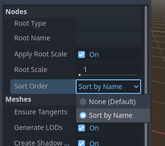

# 3D Node Sorter Import Plugin for Godot 4

A Godot plugin that allows sorting the nodes of a 3D scene imported from an external application, e.g., GL Transmission Format (.glTF) or Blender (.blend) files.

Useful for sorting meshes (e.g., by name) in order to generate and update a well indexed MeshLibrary.

## How to install

Extract the [plugin code ZIP archive](https://github.com/idealarealo/godot-3d_node_sorter_import_plugin/archive/refs/heads/main.zip) and move or merge the `addons/` folder it contains into your project folder. Then enable the plugin from Project Settings.

See [Installing Plugins - Godot Docs](https://docs.godotengine.org/en/stable/tutorials/plugins/editor/installing_plugins.html) for details.

## Sample use case - MeshLibrary with well-known tile indexes

In Blender:

1. Name the objects by prefixing them with a zero padded number, better if starting from 0.

    E.g.
    - `000_floor`
    - `001_wall1`
    - `002_wall2`
    - ...

1. Save or export all to a <ins>file</ins> (.glb, .blend, etc.) into the Godot project folder.

In Godot:

3. open the "Advanced Import Settings for Scene ..." dialog box by double clicking the <ins>file</ins>, change the "Sort Order" to "Sort by Name" and then click "Reimport".

1. Right click on the <ins>file</ins> and select "New Inherited Scene". You can now see the nodes alphanumerically sorted by Name.

1. From "Scene" menu, click on "Export As..." / "MeshLibrary..."

1. Name the MeshLibrary and uncheck the "Merge With Existing" on the bottom of the window. Then "Save".

Object meshes are saved in the same alphanumeric sort order, starting from 0. So, final indices will match the numbers indicated in the object names.

## Special tanks to

- [UtterlyMagenta](https://gist.github.com/UtterlyMagenta) for pointing me in the right direction.
